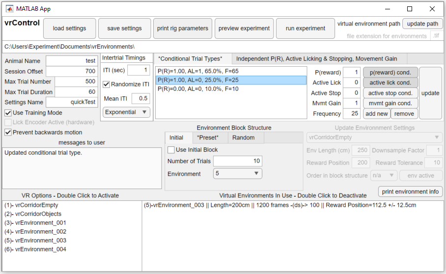
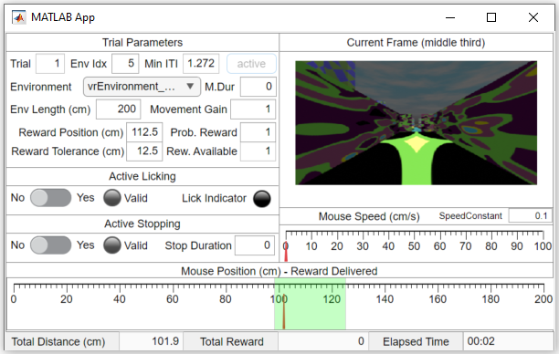

# vrControl
Code to operate linear track environments using pre-rendered environments.

## Preparing a session
The repo is designed to facilitate easy workflow for running an experiment. 
Every behavioral session starts with the interface `vrControlGUI`. It looks
like this:

The initial GUI allows extremely flexible control of all experimental 
parameters, including:

- Which environments to use (these are stored tif files on your computer)
- The reward structure, physical length, and order of each environment used
- Some meta parameters (subject name, max trial duration, intertrial interval,
number of trials, etc)
- Block structure for switching between environments
- Conditional trial type structure determining reward probability, active 
behavior for acquisition of reward (licking and stopping), and movement gain

Typical combinations of settings can be saved and reloaded, and example trial
structures can be simulated. 

## Running a session
Running a session just requires you to press the `Run Experiment` button, then
the code does (almost) the rest of the work... excluding the mouse. Since 
mouse behavior is usually done in a closed environment, a new GUI opens up 
that updates you on the mouse's progress through the task. It looks like this:

The update GUI shows you what the mouse sees on the screens surrounding it, 
along with information about the mouse's position within each trial and the 
running speed. It also shows where the reward position is and turns green if
the mouse has acquired it on each trial. There are buttons indicating whether
the mouse is licking (requires a working lick detector) and whether a mouse
has performed an "active stop" in the reward zone. 

If you are in training mode, the experimental details are editable and update
between trials. If you are in experiment mode, the details are fixed. 

## Behind the scenes
There are numerous functions working behind the scenes to run an experiment. 
The ``runExperiment`` function operates the main experimental loop, but passes
the torch to ``prepareTrial``, ``operateTrial``, ``trialEnd``, and 
``experimentEnd`` over the course of each trial. There's additional functions
for initialization and additional functions for supporting the main 
experimental loop.

This repository is built off of other code written in my lab by 
[Enny van Beest](https://github.com/EnnyvanBeest) among others, so I'm 
grateful to all of them for the initial development. 

## Installation and Usage 
The repository is entirely written in Matlab and depends on a few functions 
from [RigBox](https://github.com/cortex-lab/Rigbox), (I think) exclusively 
from the +dat package directory and the "burgbox" functions within cb-tools. 
The dat.paths function must be manually written for each rig. In addition, the
code expects a NIDAQ board and particular kinds of hardware.

If you are trying to use this code and are having trouble, feel free to get in
touch. Hardware can be set in the ``hwInfo`` section of ``runExperiment``. The
repo is built to work on a variety of rigs by loading rig-specific parameters 
in ``rigParameters`` based on the hostname of the local computer. 
